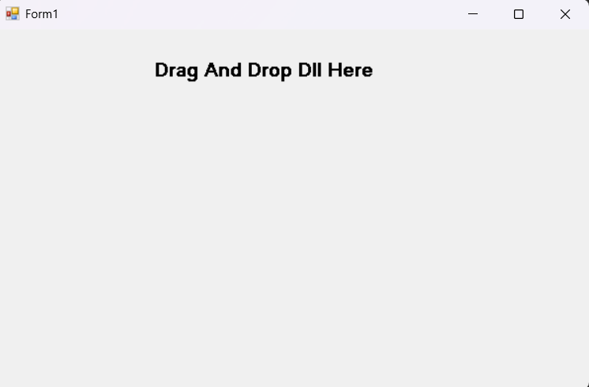

# Finxzi Obfuscator - DLL Obfuscator

**A simple obfuscator for .NET DLL files**

---

## ⚠️ Warning
This is the first version.  
The encryption and obfuscation are still **weak and experimental**.

---

## 🧠 What is Finxzi Obfuscator?

Finxzi Obfuscator is a tool designed to obfuscate `.NET DLL` files.  
It helps make code harder to read by:
- Renaming classes and methods
- Obfuscating strings
- Adding fake (junk) classes
- Using randomized Unicode-style naming

---

## 🔧 Features (v1)
- Drag & Drop DLL support  
- Basic string obfuscation  
- Randomized renaming system  
- Junk class injection  
- Simple and fast processing  

---

## 🚀 Future Improvements
- Stronger string encryption  
- Control flow obfuscation  
- Anti-decompiler protection  
- Better stability and performance  

---

## 📌 Note
This tool is for educational purposes and experimentation only.

---

## 🖼 Preview

